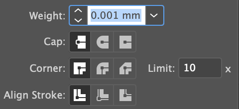

# Laser Cutter Manual

## WARNING
Using the wrong material can be **dangerous**. If you are not 100% sure about your material you must check with a community manager **BEFORE** using the laser engraving machine.

## Materials
### Must not Use
(If you use these you will fill the room with poisonous gas.)
* PVC
* Chrome tan leather
* Metal

### Ok to Use
* MDF
* Wood
* Acrylic
* Glass (only engraving)
* Leather (veg tan leather)

## Set Up
1. Open the door next to the laser engraver and put the exhaust pipe out of the door
2. Place your materials on the honeycomb table inside the engraver.
3. Put the focus guide on the laser
4. Set the height of the material using the up down buttons. When the laser is in focus the focus guide will fall.

## Preparing your Data
1. Engraving is black (RGB 0,0,0)
2. Cutting is red (RGB 255,0,0), line width 0.001mm
3. Set the line settings to the leftmost setting (screenshot)

## Usage
1. Open your file in Illustrator and click print (or ctrl-P)
2. On the print menu, choose "TrotecLaser"
3. Job control will open automatically (You may need to open the window from the menu bar)
4. Click connect "接続”
5. The laser position will be shown in JobControl.
6. Place your image on the honycomb in JobControl.
7. Choose your material settings (power and speed).
8. Press the play button to start the laser.  Do not leave the laser unattended.

## Warnings
If you are using materials that may burn (thin card and cardboard) or anything else that has a fire risk (glue on an otherwise not flammable project) keep careful watch of the laser.  

If something is going wrong opening the cover of the laser cutter stops the laser instantly.  There is also a fire extinguisher next to the laser engraver. Use it if necessary. 

# レーザー加工機マニュアル

## 材料
材料の種類が１００％わからない時はコミュニティーマネジャーに確認してください。

### 使ってはいけない材料
※この下の材料を使うと毒ガスが出て危険です。
* 塩ビ管　
* クロムなめしの革（色が鮮やかで薄い革）
* 金属

### 使える材料
* 木材
* MDF
* アクリル
* ガラス（彫刻のみ）
* 革

## セットアップ
1. レーザー加工機の横のドアを開けて排気管を外に向ける。
2. 材料をハニカムの台に置く。
3. 焦点ガイドをレーザーに引っ掛ける。
4. 上下ボタンで台を動かして焦点を合わせる。（焦点が合ったら焦点ガイドは倒れる）
## データの準備
1. 基本設定で彫刻は黒(RGB 0, 0, 0)
2. カットは赤(RGB 255, 0, 0)、線幅0.001mm
3. 線端の形状の設定をする。
## 実行
1. AdobeIllustratorでファイルを開く。
2. 印刷メニューでTrotecLaserを選択して、プリントを押す。
3. JobControlは自動的に開く。
4. 接続をクリックする。
5. JobControlでレーザーの位置が反映される。
6. 画像をハニカムに配置する。
7. 材料を選ぶ。
8. プレイボタンを押すと加工がはじまるので目を離さないようにする。

## 注意事項
燃えやすいもの（段ボールなど）や引火しやすいもの（接着剤など）を使うときには絶対に目を離さないようにしてください。

レーザー加工機のカバーを開けるとすぐ止まる。
カバーを開けると、レーザー加工機は一旦停止するので何かあったときにはカバーをすぐに開けてください。

